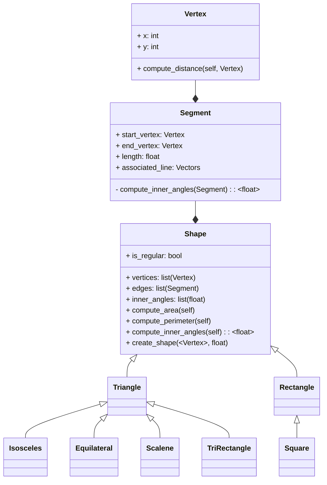

# OOP_reto_04

```mermaid

classDiagram
direction BT

    class Vertex {
        + x: int
        + y: int
        + compute_distance(self, Vertex)
    }

    class Segment {
        + start_vertex: Vertex
        + end_vertex: Vertex
        + length: float
        + associated_line: Vectors
        - compute_inner_angles(Segment): ~float~
    }
    Segment *-- Vertex

    class Shape {
        + vertices: list(Vertex)
        + edges: list(Segment)
        + inner_angles: list(float)
        + is_regular: bool
        + compute_area(self)
        + compute_perimeter(self)
        + compute_inner_angles(self) : ~float~
        + create_shape(~Vertex~, float)
    }

    Shape *-- Segment 
    Triangle --|> Shape
    Rectangle --|> Shape

    class Triangle {
    }
    Isosceles --|> Triangle
    Equilateral --|> Triangle
    Scalene --|> Triangle
    TriRectangle --|> Triangle


    class Isosceles{
    }

    class Equilateral{
    }

    class Scalene{
    }

    class TriRectangle{
    }

    class Rectangle{
    }
    Square --|> Rectangle

    class Square{
    }
```