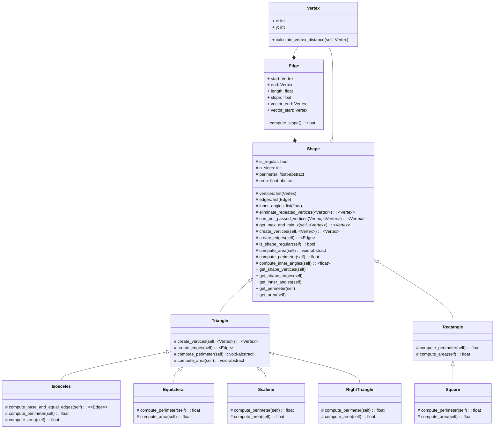

# OOP_reto_04

```mermaid

classDiagram
direction BT

    class Vertex {
        + x: int
        + y: int
        + calculate_vertex_distance(self, Vertex)
    }

    class Edge {
        + start: Vertex
        + end: Vertex
        + length: float
        + slope: float
        + vector_end: Vertex
        + vector_start: Vertex
        - compute_slope(): float
    }
    Edge *-- Vertex

    class Shape {
        # is_regular: bool
        # n_sides: int
        # vertices: list(Vertex)
        # edges: list(Edge)
        # inner_angles: list(float)
        # perimeter: float-abstract
        # area: float-abstract

        # eliminate_repeated_vertices(~Vertex~): ~Vertex~
        # sort_not_passed_vertices(Vertex, ~Vertex~): ~Vertex~
        # get_max_and_min_x(self, ~Vertex~): ~Vertex~
        # create_vertices(self, ~Vertex~): ~Vertex~
        # create_edges(self): ~Edge~
        # is_shape_regular(self): bool
        # compute_area(self): void-abstract
        # compute_perimeter(self): float
        # compute_inner_angles(self) : ~float~
        + get_shape_vertices(self)
        + get_shape_edges(self)
        + get_inner_angles(self)
        + get_perimeter(self)
        + get_area(self)
    }

    Shape *-- Edge
    Shape o-- Vertex
    Triangle --|> Shape
    Rectangle --|> Shape

    class Triangle {
        # create_vertices(self, ~Vertex~): ~Vertex~
        # create_edges(self): ~Edge~
        # compute_perimeter(self): void-abstract
        # compute_area(self): void-abstract
    }
    Isosceles --|> Triangle
    Equilateral --|> Triangle
    Scalene --|> Triangle
    RightTriangle --|> Triangle


    class Isosceles{
        # compute_base_and_equal_edges(self): ~~Edge~~
        # compute_perimeter(self): float
        # compute_area(self): float
    }

    class Equilateral{
        # compute_perimeter(self): float
        # compute_area(self): float
    }

    class Scalene{
        # compute_perimeter(self): float
        # compute_area(self): float
    }

    class RightTriangle{
        # compute_perimeter(self): float
        # compute_area(self): float
    }

    class Rectangle{
        # compute_perimeter(self): float
        # compute_area(self): float
    }
    Square --|> Rectangle

    class Square{
        # compute_perimeter(self): float
        # compute_area(self): float
    }
```